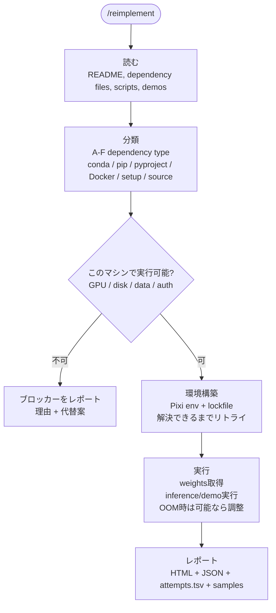

# paper-reproducer

<p align="center">
  
</p>

<p align="center">
  <strong>CV論文リポジトリを、Pixiで固定された実行環境・リトライログ・監査しやすいレポートに変換するツール。</strong>
</p>

<p align="center">
  <a href="README.md">English</a> ·
  <a href="#quick-start">Quick Start</a> ·
  <a href="#出力例">出力例</a> ·
  <a href="#ossと商用機能の境界">商用境界</a>
</p>

<p align="center">
  <a href="https://opensource.org/licenses/Apache-2.0"></a>
  <a href="https://www.claude.com/product/claude-code"></a>
  <a href="https://pixi.sh/"></a>
  
</p>

`paper-reproducer` は、GitHub上のCV論文リポジトリを再現するための Claude Code プラグインです。対象リポジトリをcloneし、依存ファイルを解析し、Pixi環境へ変換し、実行可能な推論・デモ経路を走らせ、失敗時は診断しながらリトライし、最後に再現レポートを出力します。

狙っているのは、AIコンサル・受託開発・応用研究で毎回重くなる「この論文コードは動くのか」「どこで詰まるのか」「顧客やチームに渡せる根拠は何か」を短時間で見える化することです。

## Demo

<!-- デモ動画用の予約枠です。想定フロー: ./bootstrap.sh <repo> -> /reimplement -> report.html -->

## なぜ作るのか

論文コードの再現は、アルゴリズムそのものよりも運用上の細かい問題で止まりがちです。

- 古い `conda` 環境、曖昧な `requirements.txt`、Docker前提の構成、依存ファイルなしのリポジトリ
- CUDA、PyTorch、compiler、system package のバージョン不整合
- README、Issue、スクリプトに散らばった重み・データセット・実行コマンド
- 失敗した試行がログとして残らず、次の人が同じ調査を繰り返す問題

`paper-reproducer` は、この作業を Pixi、Docker、構造化されたレポートで標準化します。

## 何をするか

1. **cloneして解析**: 対象GitHubリポジトリのREADME、依存ファイル、スクリプトを確認します。
2. **依存管理方式を分類**: conda、pip、pyproject、setup files、Dockerfile、import解析に分けます。
3. **Pixi環境を構築**: Python、CUDA、compiler、packageを宣言的に固定します。
4. **推論・デモを実行**: リポジトリに実行可能な経路があれば走らせます。
5. **診断しながらリトライ**: 最初の環境構築失敗で止めず、原因を分類して次の手を試します。
6. **レポートを生成**: 人間向けHTML、機械可読JSON、試行ログ、サンプルを残します。

## Quick Start

前提ツール:

- Docker
- Claude Code
- Python 3
- GPUを使う場合は NVIDIA Container Toolkit
- バッチモードでは `tmux` と `flock`

```bash
git clone https://github.com/DenDen047/paper-reproducer.git
cd paper-reproducer
./bootstrap.sh https://github.com/some-user/some-paper.git
```

Claude Code がコンテナ内で起動したら、次を実行します。

```text
/reimplement
```

英語レポートを出したい場合は `--lang en` を付けます。

```bash
./bootstrap.sh --lang en https://github.com/some-user/some-paper.git
```

## 出力例

各実行では、再現対象リポジトリ配下に監査しやすい記録が残ります。

| パス | 内容 |
|---|---|
| `reports/analysis.json` | リポジトリ解析、依存分類、実行可否の見立て |
| `reports/attempts.tsv` | 全試行のaction、result、error tier、duration |
| `reports/environment.json` | host、OS、CPU、GPU、CUDA、Python のスナップショット |
| `reports/report.json` | 機械可読な再現結果 |
| `reports/report.html` | 人間が確認しやすい再現レポート |
| `reports/samples/` | 再現中に得られた入出力サンプル |
| `{repo}-{short_sha}.tar.gz` | 成功時の状態スナップショット |

重要なのは「動いたかどうか」だけではありません。何を試し、何が通り、何で失敗し、次に何をすべきかが残ることです。

## 仕組み



## 対応する依存管理タイプ

対象リポジトリ内で見つかったファイルに応じて、Pixiへの変換戦略を選びます。

| 優先度 | Type | 依存ファイル | 戦略 |
|---:|---|---|---|
| 1 | A | `environment.yml`, `conda.yaml` | `pixi init --import` + divide-and-conquer |
| 2 | C | `pyproject.toml` | `pixi init --pyproject` |
| 3 | B | `requirements.txt` | `pixi init` + PyPI依存変換 |
| 4 | E | `setup.py`, `setup.cfg` | 依存抽出してPixiへ変換 |
| 5 | D | `Dockerfile` のみ | image、apt、pip、CUDAを解析してA/B戦略へ合流 |
| 6 | F | 依存ファイルなし | import解析とソースマイニング |

## バッチモード

複数URL、またはURL一覧ファイルを渡すと、`tmux` で並列実行します。

```bash
./bootstrap.sh url1.git url2.git url3.git
./bootstrap.sh --repos repos.txt
```

GPU環境では、空いているGPUを `--gpus device=N` で割り当て、`flock` により1つのGPUスロットを1ジョブだけが使うようにします。

## CLI Reference

<!-- AUTO-GENERATED: bootstrap.sh usage() is the source of truth -->

| オプション | 役割 |
|---|---|
| `--repos <file>` | URLをファイルから読み込む |
| `--rebuild` | Docker image を強制再ビルド |
| `--fresh` | 既存cloneを削除して再clone |
| `--lang <code>` | レポート言語: `ja` または `en` |
| `-h`, `--help` | ヘルプ表示 |

| 環境変数 | 役割 |
|---|---|
| `WORKSPACE_DIR` | clone先。デフォルトは `~/paper-reproduce-workspaces` |
| `REPORT_LANG` | `--lang` と同じ。`--lang` が優先 |

<!-- /AUTO-GENERATED -->

## 制約

- まずはCV論文リポジトリ向けに最適化しています。
- gated dataset、private model weights、上流ライセンス制約は回避しません。
- 論文中の主張を完全に再現できたことまでは保証しません。利用可能な再現経路とブロッカーを記録します。
- GPU負荷が大きい論文は、ローカルマシンでは実行不能な場合があります。
- 再現対象リポジトリや取得したassetは、それぞれの元ライセンスに従います。

## Roadmap

- READMEに短いデモ動画を追加する
- CV論文の再現case studyを公開する
- コンサル・調達向けの監査パックを強化する
- 未信頼の論文コードを実行するための安全ポリシーを強化する
- 社内で再現レシピを保持したいチーム向けにCI引き継ぎテンプレートを追加する
- private dashboard と商用サポートパッケージを検討する

## OSSと商用機能の境界

`paper-reproducer` 本体は Apache-2.0 ライセンスで公開しています。

このツールは第三者の論文リポジトリを取得・変更・実行しますが、それらの対象リポジトリを本プロジェクトのライセンスに変更するものではありません。対象リポジトリ、データセット、モデル重みは、それぞれの元ライセンス・利用規約に従います。

商用化する場合は、OSS本体の上に載る運用層を想定しています。private support、audit-pack生成、安全な実行profile、reporting dashboard、チーム固有のintegrationなどです。

## Development

- `main` ブランチをベースに開発します。
- 大きめの変更は `feature/<name>` ブランチで進めます。
- コミットメッセージは [Conventional Commits](https://www.conventionalcommits.org/ja/v1.0.0/) に従います。
- バージョニングは [Semantic Versioning 2.0.0](https://semver.org/lang/ja/) に従います。
- リリースノートは [CHANGELOG.md](./CHANGELOG.md) を参照してください。

## References

- [Pixi](https://pixi.sh/)
- [Claude Code](https://www.claude.com/product/claude-code)
- [karpathy/autoresearch](https://github.com/karpathy/autoresearch)
- [denkiwakame - Pixi Advent Calendar 2024](https://denkiwakame.notion.site/2ba3175c6b6a80d19141f5407c39ad4e?v=2ba3175c6b6a80a7acfe000c6c1b2117)
