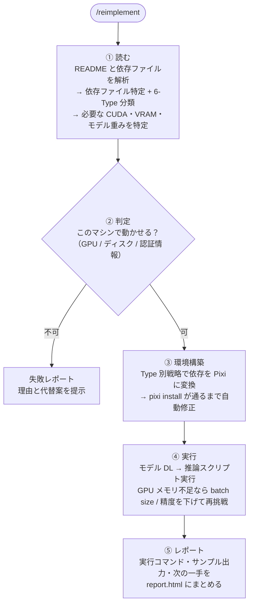

# paper-reproducer

CV 論文の GitHub リポジトリを、Claude Code エージェントで全自動再現する Claude Code プラグイン。

## Why

研究論文のコードを動かすのに最も時間がかかるのは環境構築。conda / pip / Docker / CUDA の混在を人手で解決するのは苦痛で、1リポジトリに数時間〜数日かかることもある。

本ツールは [denkiwakame 氏の Pixi ワークフロー](https://denkiwakame.notion.site/2ba3175c6b6a80d19141f5407c39ad4e?v=2ba3175c6b6a80a7acfe000c6c1b2117)に準拠し、あらゆる依存管理方式を Pixi に収束させることでこの問題を自動化する。

## Install

```bash
git clone https://github.com/DenDen047/paper-reproducer.git
cd paper-reproducer
```

Requirements: Docker, NVIDIA Container Toolkit (GPU 使用時), Claude 認証 (API key or サブスク)

## Quick Start

```bash
./bootstrap.sh https://github.com/some-user/some-paper.git
```

Claude Code が開いたらプロンプトで `/reimplement` を実行すれば、全自動再現が始まる。

## Batch mode

複数の URL、または `--repos <file>` を渡すと並列バッチで走る。

```bash
./bootstrap.sh url1.git url2.git url3.git
./bootstrap.sh --repos repos.txt
```

- 渡された URL の数だけ並列にコンテナを launch
- 複数 GPU は `CUDA_VISIBLE_DEVICES` の round-robin で自動分配
- ログは `$WORKSPACE_DIR/batch-{timestamp}/logs/{repo}.log`、サマリーは同ディレクトリの `summary.json`

## Output

`/reimplement` の実行中・完了後にホスト側へ永続化される:

| パス | 内容 |
|---|---|
| `$WORKSPACE_DIR/{repo}/reports/analysis.json` | Phase 1 の解析結果 |
| `$WORKSPACE_DIR/{repo}/reports/attempts.tsv` | Experiment Loop の全試行ログ |
| `$WORKSPACE_DIR/{repo}/reports/report.json` | 機械可読レポート |
| `$WORKSPACE_DIR/{repo}/reports/report.html` | 目視確認用レポート |
| `$WORKSPACE_DIR/{repo}/reports/samples/` | 入出力サンプル |
| `$WORKSPACE_DIR/{repo}-{short_sha}.tar.gz` | 状態スナップショット (成功時のみ) |

## How it works



### 6-Type classification

リポジトリの依存管理方式を自動判定し、すべて Pixi に変換する。

| 優先順位 | Type | 依存ファイル | 変換戦略 |
|---------|------|-------------|---------|
| 1 | A | environment.yml / conda.yaml | `pixi init --import` + Divide-and-Conquer |
| 2 | C | pyproject.toml | `pixi init --pyproject` |
| 3 | B | requirements.txt | `pixi init` + pypi-dependencies |
| 4 | E | setup.py / setup.cfg | deps 抽出 → pypi-dependencies |
| 5 | D | Dockerfile のみ | 命令解析 → Type A/B に合流 |
| 6 | F | 依存ファイルなし | import 解析 + ソースマイニング |

### Experiment Loop

[karpathy/autoresearch](https://github.com/karpathy/autoresearch) 着想の自律リトライループ。`pixi install` が通り推論が走るまで、エラー診断 → 修正 → 再試行を自動で繰り返す。全試行は `attempts.tsv` に記録される。

## Design decisions

- **Pixi**: conda-forge + uv を統合し、CUDA / gcc / CMake 等の非 Python 依存も宣言的に管理。`pixi.lock` で完全再現性を担保
- **Claude Code (Docker sandboxed)**: `ghcr.io/prefix-dev/pixi` ベースのコンテナ内で全自動実行
- **denkiwakame ワークフロー準拠**: defaults チャンネル除去、CUDA 統一、gcc を pixi 管理下に、Divide-and-Conquer、no-build-isolation 等

## Development

- `main` ブランチをベースに開発。追加機能は `feature/<name>` ブランチを切って実装し、マージする
- コミットメッセージは [Conventional Commits](https://www.conventionalcommits.org/ja/v1.0.0/) に従う

## References

- [denkiwakame - Pixi Advent Calendar 2024](https://denkiwakame.notion.site/2ba3175c6b6a80d19141f5407c39ad4e?v=2ba3175c6b6a80a7acfe000c6c1b2117) (Day 5, 12, 17, 19)
- [karpathy/autoresearch](https://github.com/karpathy/autoresearch)
