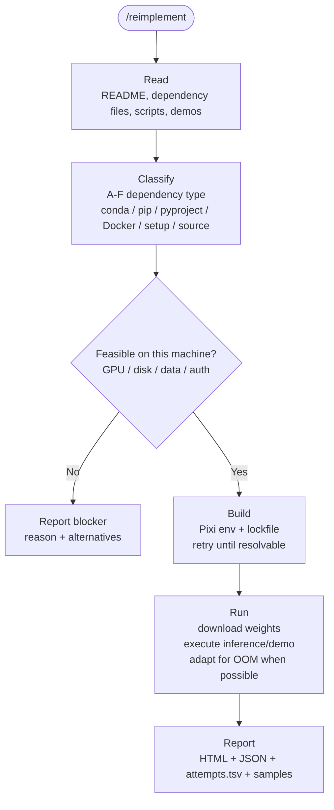

# paper-reproducer

<p align="center">
  
</p>

💡 *Turn a computer vision paper repository into a Pixi-locked environment, retry log, and audit-ready report.*

<p align="center">
  <a href="README.ja.md">Japanese</a> ·
  <a href="#quick-start">Quick Start</a> ·
  <a href="#example-output">Example Output</a> ·
  <a href="#commercial-boundary">Commercial Boundary</a>
</p>

<p align="center">
  <a href="https://opensource.org/licenses/Apache-2.0"></a>
  <a href="https://www.claude.com/product/claude-code"></a>
  <a href="https://pixi.sh/"></a>
  
</p>

`paper-reproducer` is a Claude Code plugin for reproducing CV paper repositories from a GitHub URL. It clones the target repo, analyzes dependency files, converts the environment to Pixi, runs the available inference or demo path, retries with diagnostics, and writes a reproducibility report.

It is built for the expensive middle of AI consulting and applied research work: deciding whether a paper repo can be made to run, what blocked it, and what evidence can be handed to a client or teammate.

## Demo

<!-- Reserved for the demo video. Suggested flow: ./bootstrap.sh <repo> -> /reimplement -> report.html. -->

## Why

Reproducing paper code is rarely blocked by one hard algorithmic problem. It is blocked by a pile of operational details:

- stale `conda` environments, loose `requirements.txt`, Docker-only repos, or missing dependency files
- CUDA, PyTorch, compiler, and system package mismatches
- model weights, datasets, and demo commands scattered across README issues and scripts
- failed attempts that disappear instead of becoming reusable debugging evidence

`paper-reproducer` standardizes that workflow with Pixi, Docker, and a structured audit trail, making each attempt easier to inspect, rerun, and hand off.

## What It Does

1. **Clone and inspect** a target GitHub repository.
2. **Classify dependencies** across conda, pip, pyproject, setup files, Dockerfiles, or source imports.
3. **Build a Pixi environment** with locked Python, CUDA, compiler, and package choices.
4. **Run inference or demos** when the repo exposes a feasible path.
5. **Retry with diagnostics** instead of stopping at the first environment failure.
6. **Generate reports** for human review, machine processing, and future reproduction attempts.

## Quick Start

Prerequisites:

- Docker
- Claude Code
- Python 3
- NVIDIA Container Toolkit for GPU workloads
- `tmux` and `flock` for batch mode

```bash
$ git clone https://github.com/DenDen047/paper-reproducer.git
$ cd paper-reproducer
$ ./bootstrap.sh --lang en https://github.com/some-user/some-paper.git
```

When Claude Code opens inside the container, run:

```text
/reimplement
```

For Japanese reports, omit `--lang en` or pass `--lang ja`.

## Example Output

Each run leaves an audit trail under the reproduced repository:

| Path | Purpose |
|---|---|
| `reports/analysis.json` | Repository analysis, dependency classification, feasibility notes |
| `reports/attempts.tsv` | Every build/run attempt, action, result, error tier, and duration |
| `reports/environment.json` | Host, OS, CPU, GPU, CUDA, and Python snapshot |
| `reports/report.json` | Machine-readable reproduction result |
| `reports/report.html` | Human-readable report for review or client handoff |
| `reports/samples/` | Input and output samples collected during reproduction |
| `{repo}-{short_sha}.tar.gz` | Success snapshot archive, written next to the workspace |

The important output is not just "it ran." The important output is a reusable record of what was tried, what worked, what failed, and what should happen next.

## How It Works



## Supported Dependency Types

`paper-reproducer` chooses a conversion strategy from the files found in the target repo.

| Priority | Type | Source files | Strategy |
|---:|---|---|---|
| 1 | A | `environment.yml`, `conda.yaml` | `pixi init --import` plus divide-and-conquer fixes |
| 2 | C | `pyproject.toml` | `pixi init --pyproject` |
| 3 | B | `requirements.txt` | `pixi init` plus PyPI dependency conversion |
| 4 | E | `setup.py`, `setup.cfg` | dependency extraction into Pixi |
| 5 | D | `Dockerfile` only | parse image, apt, pip, CUDA, then converge to A/B strategy |
| 6 | F | no dependency file | import analysis and source mining |

## Batch Mode

Pass multiple URLs or a file of URLs to launch parallel jobs in `tmux`.

```bash
./bootstrap.sh url1.git url2.git url3.git
./bootstrap.sh --repos repos.txt
```

In GPU environments, batch mode assigns free GPUs with `--gpus device=N` and `flock` so one GPU slot is used by one job at a time.

## CLI Reference

<!-- AUTO-GENERATED: bootstrap.sh usage() is the source of truth -->

| Option | Purpose |
|---|---|
| `--repos <file>` | Read target repository URLs from a file |
| `--rebuild` | Force Docker image rebuild |
| `--fresh` | Remove existing clones and clone again |
| `--lang <code>` | Report language: `ja` or `en` |
| `-h`, `--help` | Show help |

| Environment variable | Purpose |
|---|---|
| `WORKSPACE_DIR` | Host clone directory, default `~/paper-reproduce-workspaces` |
| `REPORT_LANG` | Same as `--lang`; overridden by `--lang` |

<!-- /AUTO-GENERATED -->

## Limitations

- Optimized for computer vision paper repositories for now.
- Does not bypass gated datasets, private model weights, or upstream license restrictions.
- Does not guarantee that a paper claim is fully reproduced; it records the available reproduction path and blockers.
- GPU-heavy papers may still be infeasible on the local machine.
- Target repositories and downloaded assets remain governed by their original licenses.

## Roadmap

- Add a short demo video in this README.
- Publish reproducible case studies from selected CV papers.
- Add richer audit packs for consulting and procurement workflows.
- Harden execution policies for untrusted paper code.
- Add CI handoff templates for teams that want to keep reproduced recipes internally.
- Explore private dashboards and commercial support packages.

## Commercial Boundary

The core `paper-reproducer` repository is Apache-2.0 licensed.

The tool downloads, modifies, and executes third-party paper repositories. Those target repositories are not relicensed by this project; their original licenses and dataset/model terms still apply.

Planned commercial work belongs above the OSS core: private support, audit-pack generation, safer execution profiles, reporting dashboards, and team-specific integration.

## Development

- Develop from the `main` branch.
- Use `feature/<name>` branches for larger changes.
- Follow [Conventional Commits](https://www.conventionalcommits.org/en/v1.0.0/).
- Use [Semantic Versioning 2.0.0](https://semver.org/).
- See [CHANGELOG.md](./CHANGELOG.md) for release notes.

## References

- [Pixi](https://pixi.sh/)
  - [denkiwakame - Pixi Advent Calendar 2024](https://denkiwakame.notion.site/2ba3175c6b6a80d19141f5407c39ad4e?v=2ba3175c6b6a80a7acfe000c6c1b2117)
- [Claude Code](https://www.claude.com/product/claude-code)
- [karpathy/autoresearch](https://github.com/karpathy/autoresearch)
